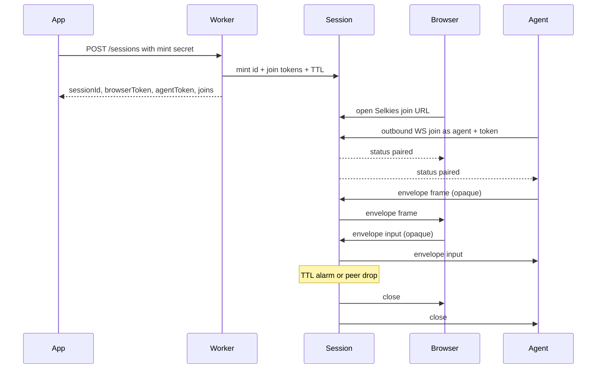

# Jolee Remote

A Cloudflare Worker + Durable Object hop. Mint a session, pair one browser WebSocket with one outbound agent WebSocket, forward opaque `frame` / `input` bytes, hibernate, and tear down on TTL or peer drop.

You bring auth, devices, and capture. Deploy this Worker to your own Cloudflare account. There is no hosted demo.

**Selkies chrome** at `/` is the session UI (modified Selkies dashboard chrome, not the Selkies streaming stack). `/viewer.html` is the canvas hole that chrome iframes.

## Quick start

```bash
npm install
npm test
npx wrangler dev
```

Local `wrangler dev` listens at `http://127.0.0.1:8787` with `MINT_SECRET` unset (open mint). HTML and hop are the same origin here.

Mint a session on the Worker (open mint locally):

```
POST http://127.0.0.1:8787/sessions
Content-Type: application/json
{"ttlSeconds": 900}
```

The `201` JSON includes `sessionId`, `browserToken`, `agentToken`, and `joins`. `joins.browser` is a **path on the hop Worker** (`/?session=<id>&hop=127.0.0.1:8787#token=<browserToken>`). Open it on the local origin, or construct:

```
http://127.0.0.1:8787/?session=<id>#token=<browserToken>
```

`hop` can be omitted when the HTML page and the Worker are the same origin (it defaults to this origin). Token is in the fragment so referrers and Worker logs do not keep it; `?token=` is still accepted as a fallback.

Then run the sample agent against the hop (defaults to `ws://127.0.0.1:8787`):

```bash
node examples/agent.mjs <sessionId> <agentToken>
```

When both sides are in, the hop forwards placeholder frames (and one cursor JSON frame so the overlay can swap to a bitmap) and prints pointer/key/wheel input.

**Production layout:** put the session HTML at `https://remote.example.com` (`remote` subdomain on your domain). The hop Worker can be any host — that is the `hop` query param. If HTML and Worker are split:

```
https://remote.example.com/?session=<id>&hop=<worker-host>#token=<browserToken>
```

Set Worker secret `MINT_SECRET` and mint against the Worker, not the HTML host (unless they are the same origin).

## Architecture


The Durable Object is the WebSocket **server**. The agent is a WebSocket **client** that connects outbound. The DO never opens outgoing WebSockets, so connections can hibernate.



More diagrams: [docs/architecture.md](docs/architecture.md).

## Byte envelope

The hop does not interpret pixels or OS events. Every binary WebSocket message is:

| Offset | Size | Field |
| --- | --- | --- |
| 0 | 1 | version (`0x01`) |
| 1 | 1 | kind: `0x01` frame (agent to browser, JPEG/WebP), `0x02` input (browser to agent, JSON opaque), `0x03` audio (agent to browser, media chunk) |
| 2.. | n | opaque payload |

Malformed envelopes and unknown kinds are dropped. Frames and audio are forwarded only from the agent connection to the browser connection. Input is forwarded only from the browser connection to the agent connection. Pairing must be complete before bytes flow. Image clipboard stays on input JSON / JSON frame; audio is kind `0x03` because it is a byte stream like frames.

Cloudflare Durable Objects accept received WebSocket messages up to **32 MiB** ([limits](https://developers.cloudflare.com/durable-objects/platform/limits/)). This hop drops envelopes larger than **1 MiB** (`MAX_ENVELOPE_BYTES`) so JPEG/WebP stills at low fps stay inside a conservative cap.

Text WebSocket messages are control JSON from the Durable Object, not the envelope:

`{"type":"status","sessionId":"...","state":"waiting|paired|expired","expiresAt":0,"browserConnected":true,"agentConnected":true}`

A connecting peer may send `{"type":"join","token":"..."}` as its first text message instead of putting the token in the query string.

Suggested viewer payload (still opaque to the hop): JSON UTF-8 inside kind `input`, e.g. `{ "t": "pointer", "e": "move", "x": 0.5, "y": 0.5 }` or `{ "t": "wheel", "dx": 0, "dy": 120, "x": 0.5, "y": 0.5 }`. Frame payload is typically a JPEG/WebP still — the viewer paints with `createImageBitmap` / `drawImage`. A JSON frame `{ "t": "cursor", "visible": true, "hx": 0, "hy": 1, "mime": "image/png", "data": "..." }` sets the overlay shape (position follows the local pointer).

## HTTP and WebSocket

The session HTML lives at `remote` on your domain (`https://remote.example.com`). The hop Worker can be a different host; that is the `hop` query param. Same origin: omit `hop`.

- `POST /sessions` on the hop Worker. Optional JSON `{ "ttlSeconds": 900 }` (1..3600, default 900). **Production requires `MINT_SECRET`**: send `Authorization: Bearer <MINT_SECRET>` or `X-Mint-Secret`. Unset in local `wrangler dev` keeps open mint. Returns `sessionId`, `browserToken`, `agentToken`, `expiresAt`, `ttlSeconds`, `joins`.
- `GET /sessions/:id` public status. Does **not** return tokens.
- **Browser HTML:** `https://remote.example.com/?session=<id>#token=<browserToken>` (same origin) or `https://remote.example.com/?session=<id>&hop=<worker-host>#token=<browserToken>` (split). Mint `joins.browser` is that path on the hop Worker, not a full `https://remote.example.com/...` URL unless UI and hop share an origin. See [docs/chrome.md](docs/chrome.md).
- Agent join (any WS client; do not require PartySocket): `wss://<worker-host>/sessions/<id>/agent?token=` still works as fallback (`joins.agent`). Prefer first text message `{"type":"join","token":"..."}` or `Authorization: Bearer` on the upgrade. Query string remains fallback.
- PartySocket path is how the canvas hole (`/viewer.html`) implements the browser socket, not a second product join: `/parties/session/:id?role=browser&token=...`.

Auth in this repo is the mint secret plus mint-time join tokens. No tenants, device directory, portal, or fleet agent. 1:1 pairing; N browsers is a later consumer need.

## Building the agent

How to plug in (mint secret, Selkies join URL, envelope, token paths): [docs/agent.md](docs/agent.md). Session print how-to (viewer shipped; consumer printer cited to IronRDP): [docs/print-redirect.md](docs/print-redirect.md).

The agent is a WebSocket **client**.

1. Your app calls `POST /sessions` with the mint secret and receives `sessionId` + `agentToken`. Open the HTML session page (`https://remote.example.com/?session=<id>#token=<browserToken>`; add `&hop=<worker-host>` if the Worker is elsewhere).
2. Connect outbound:

   `wss://<worker-host>/sessions/<sessionId>/agent?token=<agentToken>`

   Better: omit the query token and send `{"type":"join","token":"<agentToken>"}` as the first text message, or `Authorization: Bearer <agentToken>` on the upgrade. Query string is fallback. Any WebSocket client works.
3. Wait until you see a `status` message with `state: "paired"` (browser is in).
4. Send binary envelopes with kind `frame` (`0x01`) and JPEG/WebP stills under 1 MiB. Optional kind `audio` (`0x03`) is a complete media chunk agent → browser. Read kind `input` (`0x02`) JSON payloads and apply them on the device.
5. If the browser drops, the session ends. If TTL fires, the session ends. Later joins are rejected.

Rejects: mint `401` without secret when configured. Second browser or second agent (`409`). Expired (`410`). Unknown session (`404`). Bad token (`403`).

Hibernation: the session class extends `partyserver` `Server` with `static options = { hibernate: true }`. Connections are tagged `browser` / `agent` via `getConnectionTags`. After wake, tags are restored by the platform; the DO routes using those tags. One Durable Object alarm is the TTL.

## Session UI

Same origin:

```
https://remote.example.com/?session=<id>#token=<browserToken>
```

Split origin (HTML on `remote`, Worker elsewhere):

```
https://remote.example.com/?session=<id>&hop=<worker-host>#token=<browserToken>
```

That opens **Selkies chrome** (modified dashboard, MPL-2.0) at `/`. The chrome iframes `/viewer.html`, the canvas hole: PartySocket + envelope + paint + input + postMessage. Mint `joins.browser` / `viewerPath` in `src/joins.ts` is the path on the hop Worker — prefix `https://remote.example.com` when the HTML host differs.

The shell copies search params except `token` onto the hop-core iframe and puts the token on the iframe hash, which auto-connects. A host app can also postMessage `connect` / `disconnect` (plus `requestFullscreen`, `setScaleLocally`, `showVirtualKeyboard`, `clipboardUpdateFromUI`) to the iframe. The core posts status `waiting` | `paired` | `expired` | `disconnected`. See [docs/chrome.md](docs/chrome.md).

## Sample client

```
node examples/agent.mjs <sessionId> <agentToken>
node examples/agent.mjs <sessionId> <agentToken> wss://hop.example.com
```

Outbound-connects as the agent to the hop Worker (not the HTML host), sends placeholder PNG frames plus one cursor JSON frame, prints input. Proves the pipe and overlay visual. Not a real capture agent and not a Windows SendInput product. Optional third arg is the hop WebSocket origin; default `ws://127.0.0.1:8787`.

## Develop

Package scripts: `typecheck`, `test`, `dev` (`wrangler dev`), `build:dashboard`, `sync:dashboard`. Dashboard chrome builds from chrome/selkies-dashboard. Tests use `@cloudflare/vitest-pool-workers`. Deploy this Worker on your Cloudflare account; this repo has no hosted demo.

Local `wrangler dev` leaves `MINT_SECRET` unset (open mint). Production: set Worker secret `MINT_SECRET`.

## Keeping chrome in sync

This repo ships modified Selkies dashboard chrome, not the Selkies streaming stack (no selkies-web-core).

Do not bump packages past what the source uses: dashboard npm follows the pinned Selkies package.json; wrangler, workers-types, partyserver, and partysocket follow those sources, not latest-on-npm.

- **Dependabot** (weekly Monday) covers npm at `/` and `/chrome/selkies-dashboard`, plus GitHub Actions at `/`.
- **Pin:** `chrome/selkies-dashboard/UPSTREAM` records the Selkies repo, path, and commit. Files listed in `OVERLAY` are never overwritten. Jolee rewires live in `chrome/patches/selkies-dashboard/`.
- **Bump:** `./scripts/sync-selkies-dashboard.sh` with no args re-applies the pinned SHA; pass `latest` or a commit SHA to move the pin. Refresh the patch series if apply fails. Same command: `npm run sync:dashboard`.
- **Watch:** a weekday GitHub Action compares the pin to upstream and opens an issue titled "Selkies dashboard upstream moved" when they differ.

License: MIT for the hop; dashboard chrome is MPL-2.0 (see chrome/selkies-dashboard/LICENSE and NOTICE).
