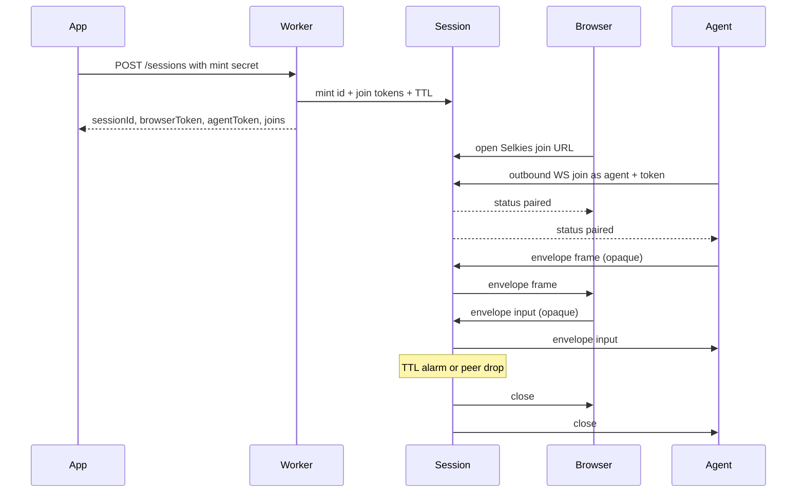

# Jolee Remote

A reusable Cloudflare Durable Objects **session-pairing framework**.
Other apps plug in their own agent and auth. This repo is the hop plus modified Selkies dashboard chrome over a canvas hole — not a remote-desktop product. There is no custom join page.

You already have (or are building) an agent that can outbound-connect, identify a device, capture frames, and inject input. This hop mints a short-lived session, pairs exactly one browser WebSocket with exactly one outbound agent WebSocket, and forwards opaque `frame` / `input` bytes through a hibernatable session Durable Object.

Example consumer: an agent you already have (for example a LetLeeIn-style agent) that outbound-connects to the session and sends capture/input. The agent itself is out of scope here except as that example.

## Who this is for

- You are building the **agent** (the missing piece): outbound WebSocket client, device identity, capture, input.
- You want a native Cloudflare hop (Worker + Durable Object + hibernation) rather than RFB, a VNC server, or a P2P desktop product.
- AI / task use that does not need 60 fps is a fine fit.

## Architecture


The Durable Object is the WebSocket **server**. The agent is a WebSocket **client** that connects outbound. The DO never opens outgoing WebSockets, so connections can hibernate.



## Byte envelope

The hop does not interpret pixels or OS events. Every binary WebSocket message is:

| Offset | Size | Field |
| --- | --- | --- |
| 0 | 1 | version (`0x01`) |
| 1 | 1 | kind: `0x01` frame (agent to browser, JPEG/WebP), `0x02` input (browser to agent, JSON opaque) |
| 2.. | n | opaque payload |

Malformed envelopes are dropped. Frames are forwarded only from the agent connection to the browser connection. Input is forwarded only from the browser connection to the agent connection. Pairing must be complete before bytes flow.

Cloudflare Durable Objects accept received WebSocket messages up to **32 MiB** ([limits](https://developers.cloudflare.com/durable-objects/platform/limits/)). This hop drops envelopes larger than **1 MiB** (`MAX_ENVELOPE_BYTES`) so JPEG/WebP stills at low fps stay inside a conservative cap.

Text WebSocket messages are control JSON from the Durable Object, not the envelope:

`{"type":"status","sessionId":"...","state":"waiting|paired|expired","expiresAt":0,"browserConnected":true,"agentConnected":true}`

A connecting peer may send `{"type":"join","token":"..."}` as its first text message instead of putting the token in the query string.

Suggested viewer payload (still opaque to the hop): JSON UTF-8 inside kind `input`, e.g. `{ "t": "pointer", "e": "move", "x": 0.5, "y": 0.5 }`. Frame payload is typically a JPEG/WebP still — the viewer paints with `createImageBitmap` / `drawImage`.

## HTTP and WebSocket

- `POST /sessions` optional JSON `{ "ttlSeconds": 900 }` (1..3600, default 900). **Production requires `MINT_SECRET`**: send `Authorization: Bearer <MINT_SECRET>` or `X-Mint-Secret`. Unset in local `wrangler dev` keeps open mint. Returns `sessionId`, `browserToken`, `agentToken`, `expiresAt`, `ttlSeconds`, `joins`.
- `GET /sessions/:id` public status. Does **not** return tokens.
- **Browser join (the product URL):** `/?session=<id>&token=<browserToken>&hop=<worker-origin>` opens Selkies chrome. `joins.browser` is this path. See [docs/chrome.md](docs/chrome.md).
- Agent join (any WS client; do not require PartySocket): `wss://<hop>/sessions/<id>/agent?token=` still works as fallback (`joins.agent`). Prefer first text message `{"type":"join","token":"..."}` or `Authorization: Bearer` on the upgrade. Query string remains fallback.
- PartySocket path is how the canvas hole (`/viewer.html`) implements the browser socket, not a second product join: `/parties/session/:id?role=browser&token=...`.

Auth in this repo is the mint secret plus mint-time join tokens. No tenants, device directory, portal, or fleet agent. 1:1 pairing; N browsers is a later consumer need.

## Building the agent

Consumer plug-in checklist (mint secret, Selkies join URL, envelope, token paths): [docs/agent.md](docs/agent.md).

The agent is a WebSocket **client**.

1. Your app calls `POST /sessions` with the mint secret and receives `sessionId` + `agentToken`. Open the browser at `joins.browser` (`/?session=&token=&hop=`).
2. Connect outbound:

   `wss://<worker-host>/sessions/<sessionId>/agent?token=<agentToken>`

   Better: omit the query token and send `{"type":"join","token":"<agentToken>"}` as the first text message, or `Authorization: Bearer <agentToken>` on the upgrade. Query string is fallback. Any WebSocket client works.
3. Wait until you see a `status` message with `state: "paired"` (browser is in).
4. Send binary envelopes with kind `frame` (`0x01`) and JPEG/WebP stills under 1 MiB. Read kind `input` (`0x02`) JSON payloads and apply them on the device.
5. If the browser drops, the session ends. If TTL fires, the session ends. Later joins are rejected.

Rejects: mint `401` without secret when configured. Second browser or second agent (`409`). Expired (`410`). Unknown session (`404`). Bad token (`403`).

Hibernation: the session class extends `partyserver` `Server` with `static options = { hibernate: true }`. Connections are tagged `browser` / `agent` via `getConnectionTags`. After wake, tags are restored by the platform; the DO routes using those tags. One Durable Object alarm is the TTL.

## Product UI

The one browser join URL is:

```
/?session=<id>&token=<browserToken>&hop=<worker-origin>
```

That opens **Selkies chrome** (modified dashboard, MPL-2.0) as the product session UI. There is no custom join page. `viewerPath` in `src/joins.ts` builds this URL.

`/viewer.html` is **not** a viewer product. It is a canvas hole: PartySocket + envelope + paint + input + postMessage. No header, no Connect button, no status pill. Do not tell consumers to replace Selkies with a custom page.

The shell copies those query params onto the hop-core iframe, which auto-connects. A host app can also postMessage `connect` / `disconnect` (plus `requestFullscreen`, `setScaleLocally`, `showVirtualKeyboard`, `clipboardUpdateFromUI`) to the iframe. The core posts status `waiting` | `paired` | `expired` | `disconnected`. The browser WebSocket uses **PartySocket** as the hole implementation. See docs/chrome.md. This repo does not run Selkies. Not a product portal.

## Tiny sample client

```
node examples/agent.mjs <sessionId> <agentToken> wss://remote.example.com
```

Outbound-connects as the agent, sends placeholder PNG frames, prints input. Proves the pipe. Not a real capture agent.

## Develop

Package scripts: `typecheck`, `test`, `dev` (`wrangler dev`), `build:dashboard`, `sync:dashboard`. Dashboard chrome builds from chrome/selkies-dashboard. Tests use `@cloudflare/vitest-pool-workers`. Do not deploy from this repo as part of the framework itself.

Local `wrangler dev` leaves `MINT_SECRET` unset (open mint). Production: set Worker secret `MINT_SECRET`.
## Keeping chrome in sync

This repo does not run Selkies and does not copy selkies-web-core. Dashboard chrome is a modified vendored copy of `addons/selkies-dashboard`.

Do not bump packages past what the source uses: dashboard npm follows the pinned Selkies package.json; wrangler, workers-types, partyserver, and partysocket follow those sources, not latest-on-npm.

- **Dependabot** (weekly Monday) covers npm at `/` and `/chrome/selkies-dashboard`, plus GitHub Actions at `/`.
- **Pin:** `chrome/selkies-dashboard/UPSTREAM` records the Selkies repo, path, and commit. Files listed in `OVERLAY` are never overwritten. Jolee rewires live in `chrome/patches/selkies-dashboard/`.
- **Bump:** `./scripts/sync-selkies-dashboard.sh` with no args re-applies the pinned SHA; pass `latest` or a commit SHA to move the pin. Refresh the patch series if apply fails. Same command: `npm run sync:dashboard`.
- **Watch:** a weekday GitHub Action compares the pin to upstream and opens an issue titled "Selkies dashboard upstream moved" when they differ.

License: MIT for the hop; dashboard chrome is MPL-2.0 (see chrome/selkies-dashboard/LICENSE and NOTICE).
