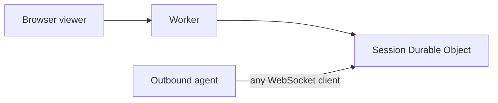
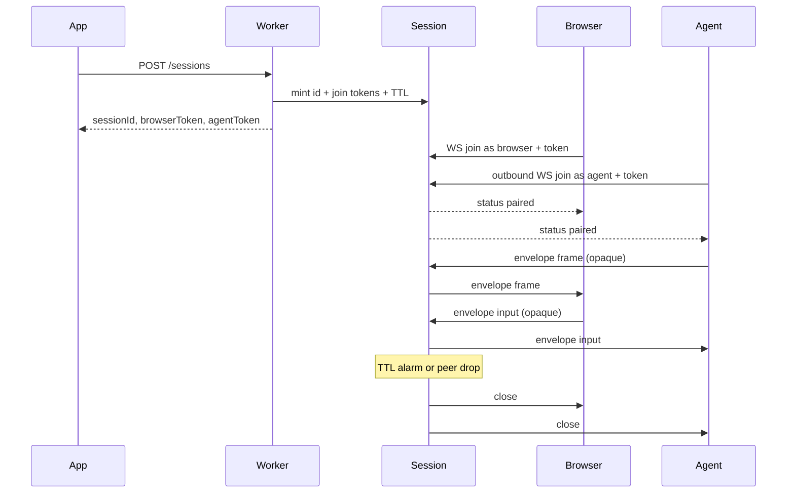

# Jolee Remote

A reusable Cloudflare Durable Objects **session-pairing framework**.
Other apps plug in their own agent and auth. This repo is the hop and a thin viewer shell — not a remote-desktop product.

You already have (or are building) an agent that can outbound-connect, identify a device, capture frames, and inject input. This hop mints a short-lived session, pairs exactly one browser WebSocket with exactly one outbound agent WebSocket, and forwards opaque `frame` / `input` bytes through a hibernatable session Durable Object.

Example consumer: an agent you already have (for example a LetLeeIn-style agent) that outbound-connects to the session and sends capture/input. The agent itself is out of scope here except as that example.

## Who this is for

- You are building the **agent** (the missing piece): outbound WebSocket client, device identity, capture, input.
- You want a native Cloudflare hop (Worker + Durable Object + hibernation) rather than RFB, a VNC server, or a P2P desktop product.
- AI / task use that does not need 60 fps is a fine fit.

## Architecture



The Durable Object is the WebSocket **server**. The agent is a WebSocket **client** that connects outbound. The DO never opens outgoing WebSockets, so connections can hibernate.



## Byte envelope

The hop does not interpret pixels or OS events. Every binary WebSocket message is:

| Offset | Size | Field |
| --- | --- | --- |
| 0 | 1 | version (`0x01`) |
| 1 | 1 | kind: `0x01` frame (agent to browser), `0x02` input (browser to agent) |
| 2.. | n | opaque payload |

Malformed envelopes are dropped. Frames are forwarded only from the agent connection to the browser connection. Input is forwarded only from the browser connection to the agent connection. Pairing must be complete before bytes flow.

Text WebSocket messages are control JSON from the Durable Object, not the envelope:

`{"type":"status","sessionId":"...","state":"waiting|paired|expired","expiresAt":0,"browserConnected":true,"agentConnected":true}`

Suggested viewer payload (still opaque to the hop): JSON UTF-8 inside kind `input`, e.g. `{ "t": "pointer", "e": "move", "x": 0.5, "y": 0.5 }`. Frame payload is typically a JPEG/PNG/WebP image or an H.264 access unit — the viewer paints with `createImageBitmap` / `drawImage` or `VideoDecoder`.

## HTTP and WebSocket

- `POST /sessions` optional JSON `{ "ttlSeconds": 900 }` (1..3600, default 900). Returns `sessionId`, `browserToken`, `agentToken`, `expiresAt`, `joins`.
- `GET /sessions/:id` public status. Does **not** return tokens.
- Browser join (any WS client, or PartySocket): `GET /sessions/:id/browser?token=...` with `Upgrade: websocket`.
- Agent join (any WS client; do not require PartySocket): `GET /sessions/:id/agent?token=...` with `Upgrade: websocket`.
- PartySocket path used by the viewer: `/parties/session/:id?role=browser&token=...` (`partyserver` room named with the session id).

Auth in this repo is the mint-time join token only. No tenants, device directory, portal, or fleet agent.

## Building the agent

The agent is a WebSocket **client**.

1. Your app calls `POST /sessions` (or you mint out of band) and receives `sessionId` + `agentToken`.
2. Connect outbound:

   `wss://<worker-host>/sessions/<sessionId>/agent?token=<agentToken>`

   Header `Authorization: Bearer <agentToken>` is also accepted. Any WebSocket client works.
3. Wait until you see a `status` message with `state: "paired"` (browser is in).
4. Send binary envelopes with kind `frame` and your capture bytes. Read kind `input` payloads and apply them on the device.
5. If the browser drops, the session ends. If TTL fires, the session ends. Later joins are rejected.

Rejects: second browser or second agent (`409`). Expired (`410`). Unknown session (`404`). Bad token (`403`).

Hibernation: the session class extends `partyserver` `Server` with `static options = { hibernate: true }`. Connections are tagged `browser` / `agent` via `getConnectionTags`. After wake, tags are restored by the platform; the DO routes using those tags. One Durable Object alarm is the TTL.

## Viewer shell

Served at `/` and `/viewer.html`. Query params: `session`, `token` (browser join token), `hop` (Worker host, default this origin). Connect, status (waiting / paired / expired / disconnected), canvas, disconnect. Uses **PartySocket** for the browser WebSocket only. Not a product portal.

## Tiny sample client

```
node examples/agent.mjs <sessionId> <agentToken> [ws://127.0.0.1:8787]
```

Outbound-connects as the agent, sends placeholder PNG frames, prints input. Proves the pipe.

## Develop

Package scripts: `typecheck`, `test`, `dev` (`wrangler dev`). Tests use `@cloudflare/vitest-pool-workers`. Do not deploy from this repo as part of the framework itself.

License: MIT.
