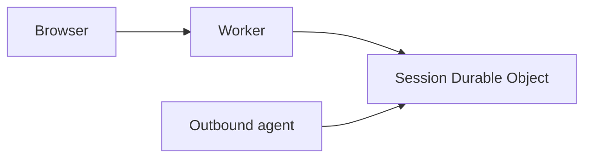
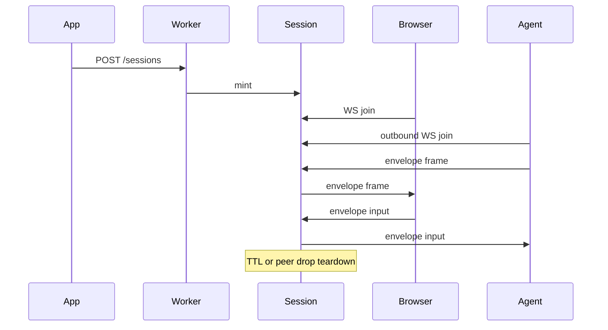
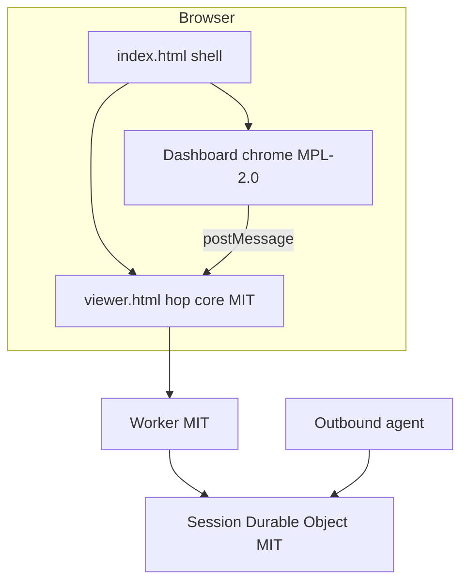

# Hop diagrams

See the root README for the full agent-builder guide. The hop is:

The browser goes through the Worker into the session Durable Object. The agent outbound-connects to that same Durable Object. The DO never dials out.

## Chrome vs hop

`/` is the product UI: modified Selkies dashboard chrome (MPL-2.0) over the hop. There is no custom join page.

`/viewer.html` is not a viewer product. It is the hop core / canvas hole (MIT): PartySocket + envelope + paint + input + postMessage. The Worker and session Durable Object stay the MIT session-pairing pipe. Jolee Remote does not run Selkies. See chrome.md.

