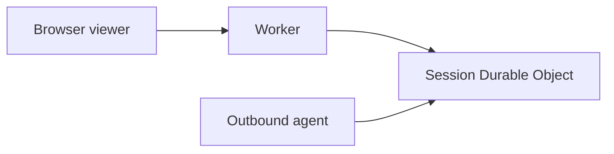
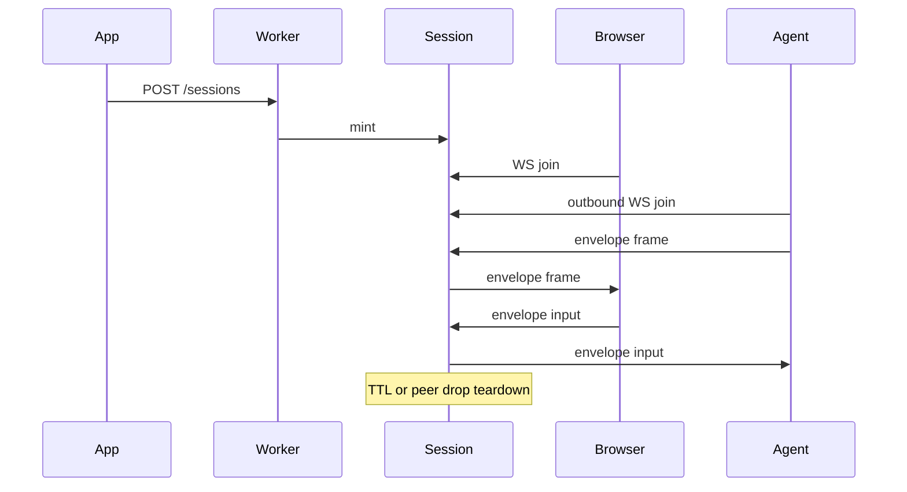

# Hop diagrams

See the root README for the full agent-builder guide. The hop is:

Browser viewer goes through the Worker into the session Durable Object. The agent outbound-connects to that same Durable Object. The DO never dials out.

# Chrome vs hop

The hop in this document is MIT. Dashboard chrome is a modified Selkies example dashboard (MPL-2.0) that overlays the hop core iframe and talks to it with postMessage. Jolee Remote does not run Selkies. Details: chrome.md.
