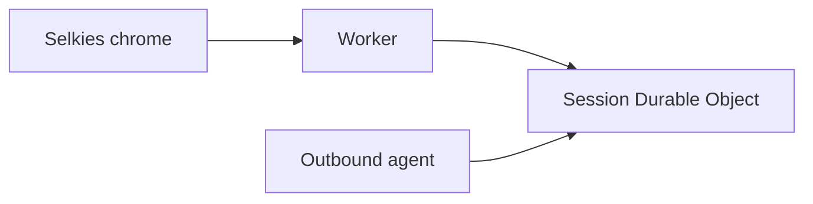
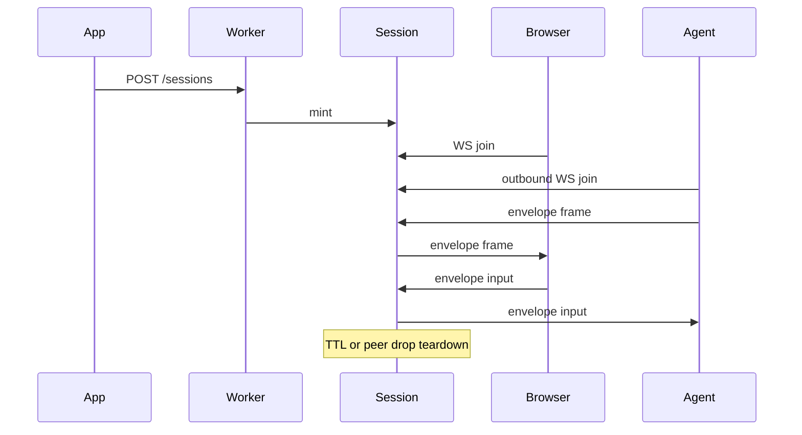
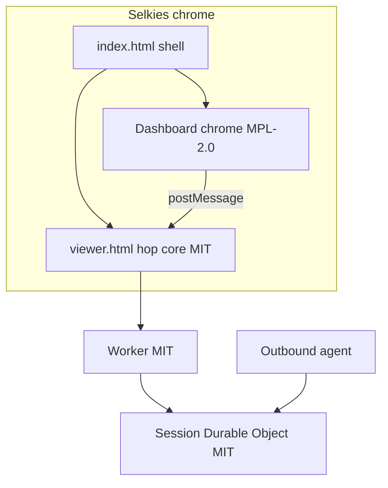

# Architecture

Reusable Cloudflare Durable Objects session-pairing framework: mint, pair browser + outbound agent WebSocket, hibernation, TTL, teardown.

Session-pairing hop on Cloudflare Workers and Durable Objects. See the root README for integration. Diagrams below:

The browser joins through the Worker into the session Durable Object. The agent outbound-connects to that same Durable Object. The DO never dials out.

## Chrome vs hop

`/` is Selkies chrome (modified dashboard, MPL-2.0), the product session UI.

`/viewer.html` is the canvas hole (MIT): PartySocket + envelope + paint + input + postMessage. The Worker and session Durable Object are the MIT pairing pipe. This repo ships modified Selkies dashboard chrome, not the Selkies streaming stack. See [chrome.md](chrome.md).

