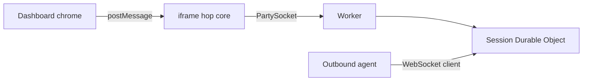

# Dashboard chrome

`/` is the product session UI: modified Selkies dashboard chrome (MPL-2.0) over the hop. There is no custom join page. Do not replace Selkies with a custom page.

`/viewer.html` is **not** a viewer product. It is a canvas hole: PartySocket, byte envelope, canvas paint, pointer/key input, and postMessage. No header, no Connect button, no status pill.

Jolee Remote does not run Selkies, selkies-web-core, pixelflux, or the Selkies protocol.

Dashboard chrome is MPL-2.0 (see `chrome/selkies-dashboard/LICENSE`). The hop (`src/`, `public/viewer.html`, Worker, Durable Object) is MIT.

## Join

The one browser join URL opens Selkies chrome:

```
/?session=<id>&token=<browserToken>&hop=<worker-origin>
```

| param | meaning |
| --- | --- |
| `session` | session id from `POST /sessions` |
| `token` | browser join token |
| `hop` | Worker host; default this origin |

`joins.browser` from mint is this path (`viewerPath` in `src/joins.ts`). `public/index.html` is a tiny shell: it copies the page search params onto `iframe#jolee-core` (`/viewer.html`). The hop core auto-connects from those params. A host app can also postMessage `connect` (and `disconnect`) to the iframe. There is no custom join form.


## postMessage contract

Same-origin `window` messages from the parent shell to `iframe#jolee-core`.

Handled by the hop core:

| type | payload | core action |
| --- | --- | --- |
| `connect` | `{session, token, hop}` | PartySocket join as browser |
| `disconnect` | | close socket |
| `requestFullscreen` | | canvas.requestFullscreen() |
| `setScaleLocally` | `{value: boolean}` | CSS object-fit contain vs stretch/fill |
| `showVirtualKeyboard` | | focus canvas (and optional hidden input) |
| `clipboardUpdateFromUI` | `{text}` | input envelope `{t:clipboard, text}` if connected; no-op otherwise |

Core to parent (only when window.parent is not window):

| type | payload |
| --- | --- |
| `status` | `{state: waiting | paired | expired | disconnected}` |

Other Selkies pipeline toggles (pipelineControl, settings, gamepadControl, setManualResolution, resetResolutionToWindow, setUseCssScaling, setAntiAliasing, audioDeviceSelected, requestGamingMode, command, getStats, sidebarVisibilityChanged, TOUCH_GAMEPAD_SETUP, TOUCH_GAMEPAD_VISIBILITY, touchinput:trackpad, touchinput:touch, setSynth, clipboardImageUpdate, setUseBrowserCursors, mode) are ignored with a one-line comment. They do not crash the core.




## Keeping chrome in sync

This repo does not run Selkies and does not copy selkies-web-core.

Do not bump packages past what the source uses: dashboard npm follows the pinned Selkies package.json; wrangler, workers-types, partyserver, and partysocket follow those sources, not latest-on-npm.

Dependabot covers npm weekly (Monday) at `/` and `/chrome/selkies-dashboard`, plus GitHub Actions at `/`. The dashboard is pinned in `chrome/selkies-dashboard/UPSTREAM`; overlay files in `OVERLAY` are kept; Jolee rewires are `chrome/patches/selkies-dashboard/` plus `scripts/sync-selkies-dashboard.sh` (`latest` or a SHA). A weekday Action opens an issue titled "Selkies dashboard upstream moved" when the pin is behind.

