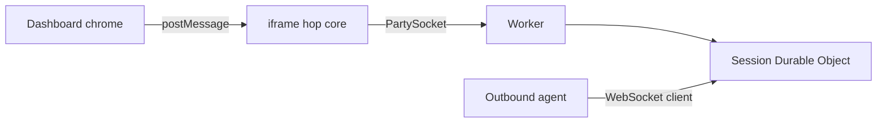

# Dashboard chrome

The page at `/` is a shell: a full-viewport hop-core iframe plus a modified Selkies dashboard overlay. The hop core (`/viewer.html`) stays PartySocket + envelope + canvas. Jolee Remote does not run Selkies, selkies-web-core, pixelflux, or the Selkies protocol.

Dashboard chrome is MPL-2.0 (see `chrome/selkies-dashboard/LICENSE`). The hop (`src/`, `public/viewer.html`, Worker, Durable Object) is MIT.

## postMessage contract

Same-origin `window` messages from the parent shell to `iframe#jolee-core` (`/viewer.html?embedded=1`).

Handled by the hop core:

| type | payload | core action |
| --- | --- | --- |
| `connect` | `{session, token, hop}` | PartySocket join as browser |
| `disconnect` | | close socket |
| `requestFullscreen` | | canvas.requestFullscreen() |
| `setScaleLocally` | `{value: boolean}` | CSS object-fit contain vs stretch/fill |
| `showVirtualKeyboard` | | focus canvas (and optional hidden input) |
| `clipboardUpdateFromUI` | `{text}` | input envelope `{t:clipboard, text}` if connected; no-op otherwise |

Core to parent (only when window.parent is not window):

| type | payload |
| --- | --- |
| `status` | `{state: waiting | paired | expired | disconnected}` |

Other Selkies pipeline toggles (pipelineControl, settings, gamepadControl, setManualResolution, resetResolutionToWindow, setUseCssScaling, setAntiAliasing, audioDeviceSelected, requestGamingMode, command, getStats, sidebarVisibilityChanged, TOUCH_GAMEPAD_SETUP, TOUCH_GAMEPAD_VISIBILITY, touchinput:trackpad, touchinput:touch, setSynth, clipboardImageUpdate, setUseBrowserCursors, mode) are ignored with a one-line comment. They do not crash the core.

Query param `embedded=1` hides the header join bar. HopControls in the dashboard is the join UI.

## Keeping chrome in sync

This repo does not run Selkies and does not copy selkies-web-core.

Dependabot covers npm weekly (Monday) at `/` and `/chrome/selkies-dashboard`, plus GitHub Actions at `/`. The dashboard is pinned in `chrome/selkies-dashboard/UPSTREAM`; overlay files in `OVERLAY` are kept; Jolee rewires are `chrome/patches/selkies-dashboard/` plus `scripts/sync-selkies-dashboard.sh` (`latest` or a SHA). A weekday Action opens an issue titled "Selkies dashboard upstream moved" when the pin is behind.

